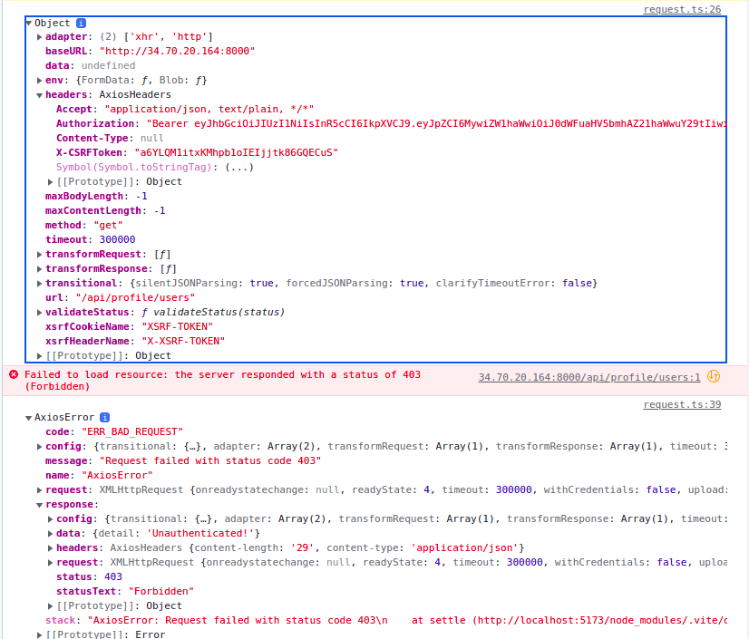

# wanna-date-web

Front-end side of wanna date web app

## Install and run

```bash
yarn
yarn dev
```

## Current issue

After login, server response 403 despite of having `Authorization` in header.

**Reproduce steps:**

-   Run web by `yarn dev`
-   In login page, after filling `email` and `password`. The web route will be directed to `/match`.
-   Open `Developer tool` in browser, `Ctrl + Shift + I` is the shortcut.
-   Navigate to `Console` tab and the error will be appearing.

**APIs call steps**

-   In login page, after filling, `axios` will call `/api/auth/login`
-   In the mean time of switching to `/match`, `axios` will call `/api/profile/users` <==== ERROR here


